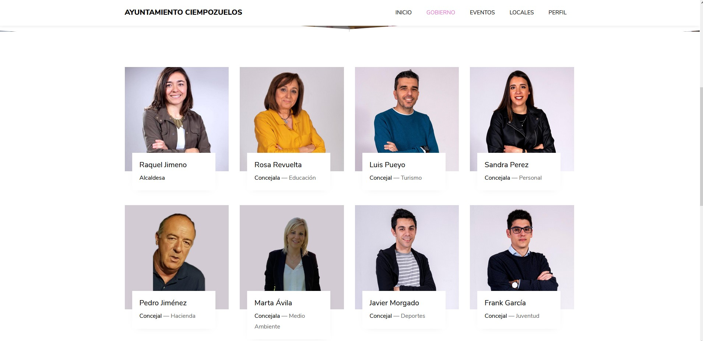
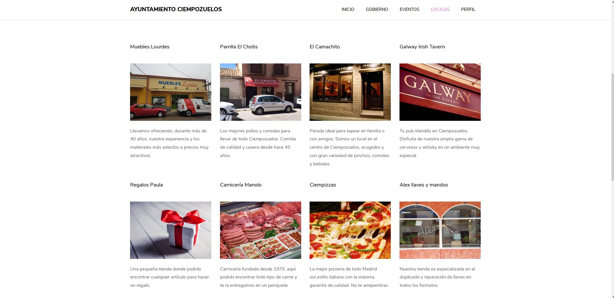
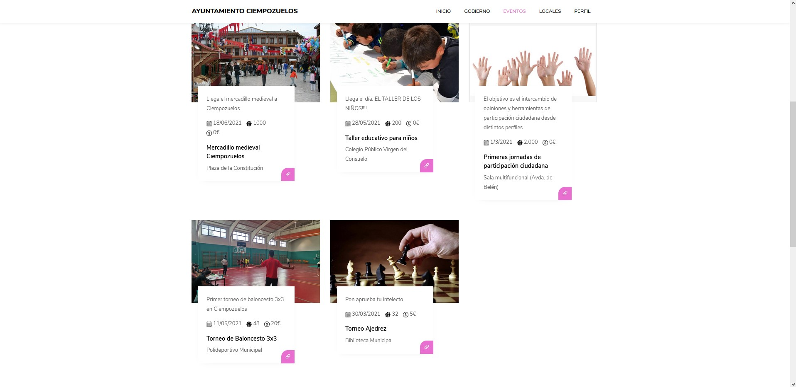
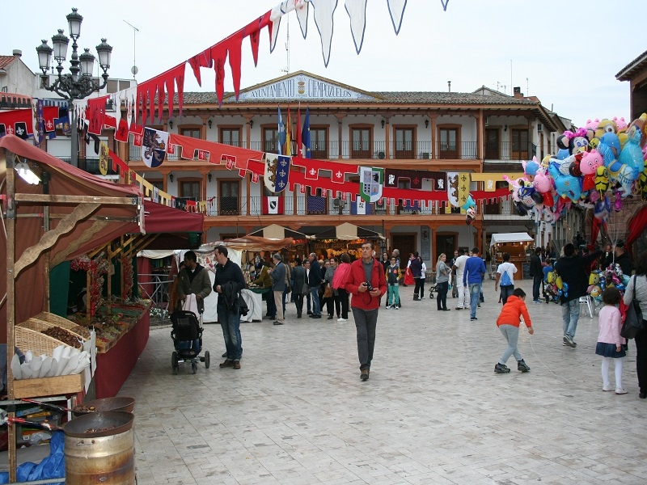
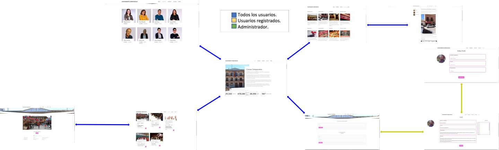
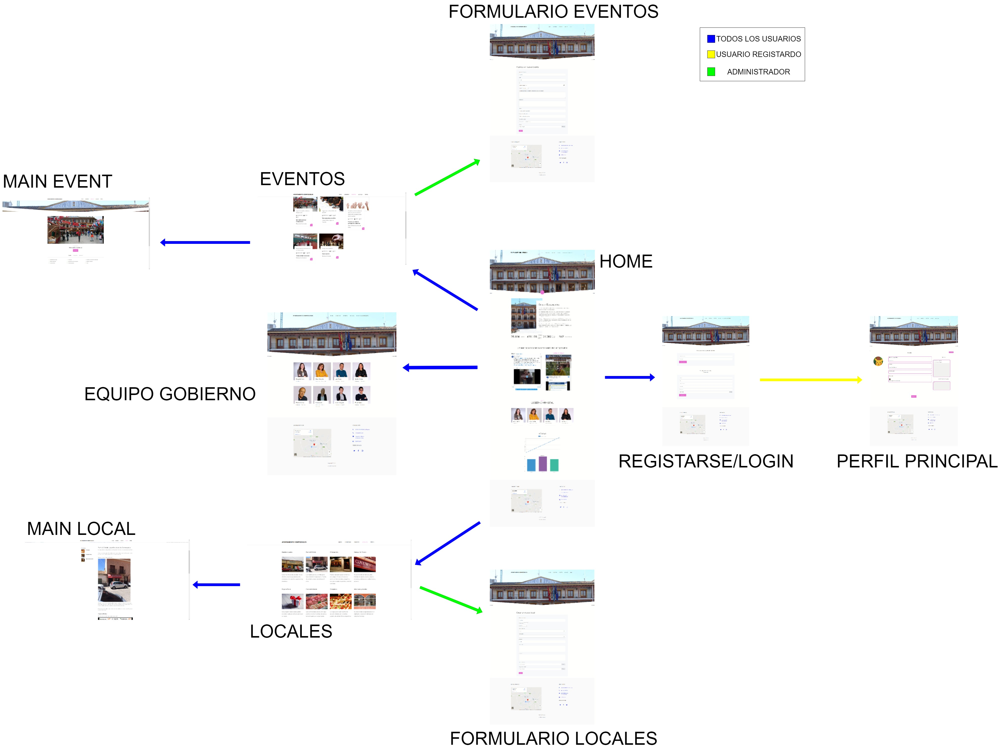
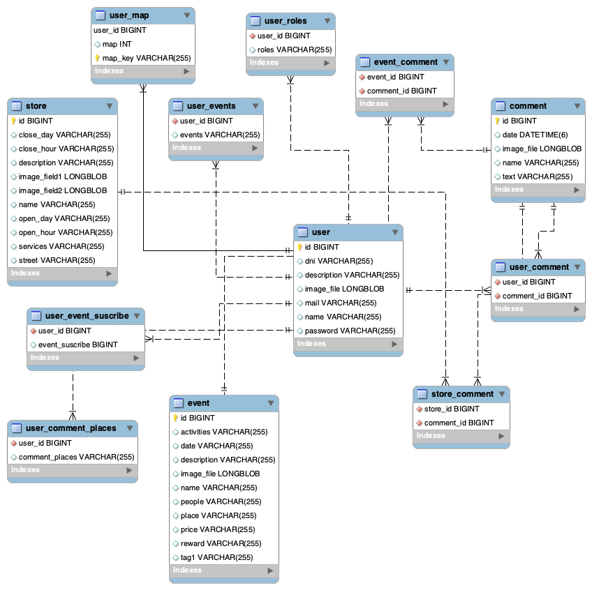
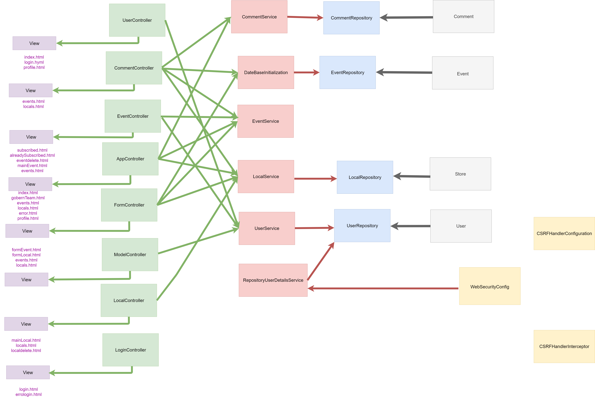

# AYUNTAMIENTO DE CIEMPOZUELOS

Project developed as an assignment for Web Application Development subject, Software Engineering degree. Rey Juan Carlos University 2020/2021

Development off a web application for the city council of ciempozuelos.

##  Team members

| NAME  | EMAIL | GITHUB MEMBER |
| ----- | ----- | ------------- |
| Yeray Cornejo | y.cornejo.2018@alumnos.urjc.es  | Yeray-Cornejo |
| Israel Pozuelo  | i.pozuelo.2018@alumnos.urjc.es  | Israelpzl |
| Alvaro Cano | a.canog.2018@alumnos.urjc.es  | Alvaro-Cano |
| Adrian Muñoz  | a.munozm.2018@alumnos.urjc.es | adri-m173 |
| Antonio Cuadrado  | a.cuadrado.2018@alumnos.urjc.es | cuadantonio |

##  Complementary tools

Link to Trello: https://trello.com/b/ECkQfNyt/daw-g-14

##  Important aspects of the web application

### Entities

Now we are going to explain some points of the entities:

1.  **User** : Type of user with their personal data, permissions and other interactions.
2.  **Local events** :  Different events that the town has, with their schedules and information about it.
3.  **Locals reviews** : Reviews and scores about locals of the city, written by the habitants.
4.  **Local entertainment** : Premises, information and opinions on these.

### User permissions

1.  **Administrator** : Add events and news, modify aspects of the website and user management
2.  **Habitant** : Being able to add comments and change them, manage profiles and join events.
3.  **Stranger** : Browse the website

### Images

1.  **Locals photos** 
2.  **Event photos**
3.  **User Avatar**
4.  **Government team photos**

### Graphics

1.  **Event audience charts** : Number of participants in different events
2.  **Registered users graph** : Number of registered users compared to visits

### Complementary technology

1.  **Maps**

### Algorithm or advanced query

1.  **Recommendation of related events that you have previously signed up for**

## PHASE 1: Website structure by HTML and CSS

### Main Page 
Presentation of the website:
 

### Goberment Page 
Show all the people of the government:
 

### Local Page 
Shows the different local in Ciempozuelos:

### Local Specification page
More information of the local:

### Events page 
Shows the different events in Ciempozuelos:

### Event Specification page 
More information of the event:

### Login page

### Profile page
Shows user information:

### Navigation Diagram:

## PHASE 2: Server web technologies

### Development direction

-  **Repository: Github/webapp14** 
-  **Development tools: Intellij, Spring Tool Suite4.**
-  **Dependencies: MySQL Workbench**
-  **To be able to execute the files included in this repository yo should follow the next steps:**

1. Open the project in Spring Tool Suite4.
2. Start a service MySQL in the local host.
3. Start a connection with de database from the ip: 127.0.0.1 in the port: 3306 with the user "root"and without password. We recomend using MySQL Workbench.
4. (RECOMENDED) In Spring, right click over the root project folder > Maven > Update Project
5. Start running the applicattion from Spring by Spring Boot App.
6. Enter from a browser to: https://localhost:8443

### Diagrams

### Navigation Diagram for navegations:
 

### Data Base Diagram:
 

### Class-Template Diagram
 
 
### Members participation

**Israel**

- Completed tasks: I first worked on creating a mustache template for the event page. After the user registration part, I did the commit, but my colleagues helped me to a large extent. Then I took care of adding two buttons to create and delete events / locales. Finally I investigated how to put the advanced technology and I managed to put a dynamic map

- 5 most significant commits:

1. [Add Map in local page](https://github.com/CodeURJC-DAW-2020-21/webapp14/commit/91e9bd763f8cd8fa3430581997aaba11946b7dcd)
2. [delete Event](https://github.com/CodeURJC-DAW-2020-21/webapp14/commit/e5bc742dc3444950d62f838bf926db183cf7c558)
3. [Add buttmon Local and delete Local](https://github.com/CodeURJC-DAW-2020-21/webapp14/commit/fb0125f01be81d47145a618f11d52139a3949d86)
4. [add register](https://github.com/CodeURJC-DAW-2020-21/webapp14/commit/be3215ae35b51b6e0113072cc09a9314cafddd97)
5. [Add event mustache](https://github.com/CodeURJC-DAW-2020-21/webapp14/commit/e593355d4d720bd1cb716a137f4776d74abe04c9)

- 5 files with participation:

1. [UserController](https://github.com/CodeURJC-DAW-2020-21/webapp14/blame/main/Backend/src/main/java/daw/urjc/ayuntamiento/controller/UserController.java)
2. [LoginController](https://github.com/CodeURJC-DAW-2020-21/webapp14/blame/main/Backend/src/main/java/daw/urjc/ayuntamiento/controller/LoginController.java)
3. [MainLocal](https://github.com/CodeURJC-DAW-2020-21/webapp14/blame/main/Backend/src/main/resources/templates/mainLocal.html)
4. [MainEvent](https://github.com/CodeURJC-DAW-2020-21/webapp14/blame/main/Backend/src/main/resources/templates/mainEvent.html)
5. [EventController](https://github.com/CodeURJC-DAW-2020-21/webapp14/blame/main/Backend/src/main/java/daw/urjc/ayuntamiento/controller/EventController.java)

**Álvaro**

-  Completed tasks: In this phase I worked mostly in the comments in local and events and in the security with ssl in the web. Also i helpeed my teammates and work to solve errors. Also I created the html for the local and event with Mustache.

- 5 most significant commits:

1. [Add certificate keystore.jks and changed to port 8443](https://github.com/CodeURJC-DAW-2020-21/webapp14/commit/7ac5eba0d039f8f33c016c8ee572b4c9b926c178)
2. [local page implemented with mustache](https://github.com/CodeURJC-DAW-2020-21/webapp14/commit/ca4e040a9d0890b635f16ef85ce97637f19999fb)
3. [Main event created and and perfil image fixed](https://github.com/CodeURJC-DAW-2020-21/webapp14/commit/b651a779d749a7bd53ae2d76fa2c9ce90093af17)
4. [Comments in events page created](https://github.com/CodeURJC-DAW-2020-21/webapp14/commit/0d20fcc5db4bec9419ed8f3d8e6c83a54c25dbfe)
5. [Comments in local done](https://github.com/CodeURJC-DAW-2020-21/webapp14/commit/9b58b16bbe79a591fbcc99201ce0a5be19926ce2)

- 5 files with participation:

1. [CommentController.java](https://github.com/CodeURJC-DAW-2020-21/webapp14/blob/main/Backend/src/main/java/daw/urjc/ayuntamiento/controller/CommentController.java)
2. [LocalController.java](https://github.com/CodeURJC-DAW-2020-21/webapp14/blob/main/Backend/src/main/java/daw/urjc/ayuntamiento/controller/LocalController.java)
3. [UserController.java](https://github.com/CodeURJC-DAW-2020-21/webapp14/blob/main/Backend/src/main/java/daw/urjc/ayuntamiento/controller/UserController.java)
4. [WebSecurityConfig.java](https://github.com/CodeURJC-DAW-2020-21/webapp14/blob/main/Backend/src/main/java/daw/urjc/ayuntamiento/security/WebSecurityConfig.java)
5. [mainEvent.html](https://github.com/CodeURJC-DAW-2020-21/webapp14/blob/main/Backend/src/main/resources/templates/mainEvent.html)

**Yeray**

- Completed tasks:

- At a global level, he worked with Alvaro in creating events, events, and comments. Both in the controllers and in the HTML files thus implementing the moustage. On the other hand, we also worked on the implementation of all the elements in the database. In addition to solving numerous errors that have arisen by the app

- 5 most significant commits:

1. [Fix createEvent and fix to see the new Events](https://github.com/CodeURJC-DAW-2020-21/webapp14/commit/1b6ff1cc2882052f21efa5c0f9b727a2300cccd3)
2. [Update and fix error](https://github.com/CodeURJC-DAW-2020-21/webapp14/commit/89ebdf8239de0a6a2d865af04a99b96f1ffdbc25)
3. [Add map in user and add suscribe botton in events](https://github.com/CodeURJC-DAW-2020-21/webapp14/commit/45b0090ad4d9f9caedc171bcc1fb0f4b9faf322f)
4. [Update with error pages](https://github.com/CodeURJC-DAW-2020-21/webapp14/commit/8812d5aeab221127af1255199d0eacb5a56247fd)
5. [Update events](https://github.com/CodeURJC-DAW-2020-21/webapp14/commit/d7a738341e3c29c2b19f067c37ae00fd7c6fb8cc)

- 5 files with participation:

1. [FormController.java](https://github.com/CodeURJC-DAW-2020-21/webapp14/blob/main/Backend/src/main/java/daw/urjc/ayuntamiento/controller/FormController.java)
2. [EventController.java](https://github.com/CodeURJC-DAW-2020-21/webapp14/blob/main/Backend/src/main/java/daw/urjc/ayuntamiento/controller/EventController.java)
3. [formLocal.html](https://github.com/CodeURJC-DAW-2020-21/webapp14/blob/main/Backend/src/main/resources/templates/formLocal.html)
4. [formEvent.html](https://github.com/CodeURJC-DAW-2020-21/webapp14/blob/main/Backend/src/main/resources/templates/formEvent.html)
5. [repository](https://github.com/CodeURJC-DAW-2020-21/webapp14/tree/main/Backend/src/main/java/daw/urjc/ayuntamiento/repository)

**Cuadrado**

- Completed tasks: My work in this phase was mainly to create the AJAX system on the Events and Locals page. I also worked on a badge system that updates when you either comment on an event or an store and when you subscribe to an event, and another really important part of my job was to create a history system that puts on your profule page where you have commented or to which events you have subscribed. Also, I have worked with all my teammates on different tasks which everyday someone different commited it.

- 5 most significant commits:

1. [AJAX created](https://github.com/CodeURJC-DAW-2020-21/webapp14/commit/f3d8083b2a198238f01abad557a10bf6cd8217c6)
2. [Infinite loop fixed](https://github.com/CodeURJC-DAW-2020-21/webapp14/commit/4d81eef6f8ee3d812748c0ba12ce3945835e3782)
3. [History made](https://github.com/CodeURJC-DAW-2020-21/webapp14/commit/79e438a6f98611bcae923e474b285bb06f3685a5)
4. [Badge system created](https://github.com/CodeURJC-DAW-2020-21/webapp14/commit/5c654f383c98fa6ea29e494172194245406152b9)
5. [Register made](https://github.com/CodeURJC-DAW-2020-21/webapp14/commit/0e3e61ddd94bc91ad8ca46713a17c984803d11bf)

- 5 files with participation:

1. AppController.java
2. ajaxevents.js
3. DataBaseInitialization.java
4. User.java
5. events.html

**Adri**

- Completed tasks:
On this fase, I have been done lot of working with the initialization of the Spring project, making the structure and translating all the frontend files to the Spring project structure directories. 
In the first steps of the phase, I have been working with mustache for make a common header and footer.
Also, y have been working with the comments of the webpage, with the comments of events and locals. 
Also I have been working doing the metrics of the webpage, with lines and bars graphics and with real information of the webpage and his interactions, for example, with number of local and events, comments, and registered users.
I have also been working with the diagrams of the project, for exameple with the ER Diagram, and classes/templates diagram.
At the end of the phase, I have been working with the DataBaseInitialization for make the webpage with real data examples.
I have also been helping my colleagues when they have needed it in some tasks to my colleagues in their functionalities, like all team members.

- 5 most significant commits:

1. [Registered users and interaction graphics working](https://github.com/CodeURJC-DAW-2020-21/webapp14/commit/5c644c60a6cb3807f6c5b91cdb3441826e39b613)
2. [Head pages with common footer (mustache)](https://github.com/CodeURJC-DAW-2020-21/webapp14/commit/fdf286b1734c1e7037791cf4b5e1cf8bfcda833e)
3. [Spring project created](https://github.com/CodeURJC-DAW-2020-21/webapp14/commit/5da7adb84f0b4ec49b538118813e7eb09b143d4f)
4. [DataBaseInitialization done and some unnecessary images deleted](https://github.com/CodeURJC-DAW-2020-21/webapp14/commit/0d565dc4e6a1b1443fab85909e8b1db4084d0dd0)
5. [ER Diagram](https://github.com/CodeURJC-DAW-2020-21/webapp14/commit/242e519646037954412fcc4ad83b3e18e2e81987)

- 5 files with participation:

1. DataBaseInitialization.java
2. Index.html
3. Comments.java
4. AppController.java
5. CommentController.java

## PHASE 3: API Rest incorporation and Docker deploying

### API Rest documentation
The documentation for the API Rest can be found on a [Postman Collection file](https://github.com/CodeURJC-DAW-2020-21/webapp14/blob/main/api.postman_collection.json) found on the root of the directory, and also on an [HTML File](https://rawcdn.githack.com/CodeURJC-DAW-2020-21/webapp14/5e6f1003912bd857655fefbf3e065edfa6ef1d54/api-docs/api-docs.html) and an [YAML File](https://github.com/CodeURJC-DAW-2020-21/webapp14/blob/main/api-docs/api-docs.yaml) both found on the api-docs directory.

### Class diagram updated

### Dockerized app execution instructions and Docker image construction documentation
To make it easy for the user we have made a Linux script that installs you Docker on your computer, builds the image and executes it.
Steps:
1. Open a Linux command shell on the [Docker directory](https://github.com/CodeURJC-DAW-2020-21/webapp14/tree/main/Docker)
2. Execute the create_image.sh script with the command line ./create_image.sh (If you have trouble doing it try with sudo ./create_image.sh)
3. The dockerized app is already running due to the script, so on your web browser write https://localhost:8443
4. When you want to stop the app just type on the command shell docker-compose down

### Docker image construction documentation

### Members participation

**Israel**

- Completed tasks: I first worked on creating a mustache template for the event page. After the user registration part, I did the commit, but my colleagues helped me to a large extent. Then I took care of adding two buttons to create and delete events / locales. Finally I investigated how to put the advanced technology and I managed to put a dynamic map

- 5 most significant commits:

1. [Add Map in local page](https://github.com/CodeURJC-DAW-2020-21/webapp14/commit/91e9bd763f8cd8fa3430581997aaba11946b7dcd)
2. [delete Event](https://github.com/CodeURJC-DAW-2020-21/webapp14/commit/e5bc742dc3444950d62f838bf926db183cf7c558)
3. [Add buttmon Local and delete Local](https://github.com/CodeURJC-DAW-2020-21/webapp14/commit/fb0125f01be81d47145a618f11d52139a3949d86)
4. [add register](https://github.com/CodeURJC-DAW-2020-21/webapp14/commit/be3215ae35b51b6e0113072cc09a9314cafddd97)
5. [Add event mustache](https://github.com/CodeURJC-DAW-2020-21/webapp14/commit/e593355d4d720bd1cb716a137f4776d74abe04c9)

- 5 files with participation:

1. [UserController](https://github.com/CodeURJC-DAW-2020-21/webapp14/blame/main/Backend/src/main/java/daw/urjc/ayuntamiento/controller/UserController.java)
2. [LoginController](https://github.com/CodeURJC-DAW-2020-21/webapp14/blame/main/Backend/src/main/java/daw/urjc/ayuntamiento/controller/LoginController.java)
3. [MainLocal](https://github.com/CodeURJC-DAW-2020-21/webapp14/blame/main/Backend/src/main/resources/templates/mainLocal.html)
4. [MainEvent](https://github.com/CodeURJC-DAW-2020-21/webapp14/blame/main/Backend/src/main/resources/templates/mainEvent.html)
5. [EventController](https://github.com/CodeURJC-DAW-2020-21/webapp14/blame/main/Backend/src/main/java/daw/urjc/ayuntamiento/controller/EventController.java)

**Álvaro**

-  Completed tasks: In this phase I worked mostly in the controller for api rest in events and graphics. Also I created the api documentation and the script to use the app dockerized.

- 5 most significant commits:

1. [Event Rest Controller for api created and Endpoints created](https://github.com/CodeURJC-DAW-2020-21/webapp14/commit/6ee886a3d816d2518424f2cec83bf045b50e961c)
2. [Graphic rest controller](https://github.com/CodeURJC-DAW-2020-21/webapp14/commit/84cd3b8288dd28158ba25815dd2ae34a4847cc93)
3. [Api Rest postman collection updated with graphic endpoints](https://github.com/CodeURJC-DAW-2020-21/webapp14/commit/36053ac12b261010aa60916e3450d9f8b1a39710)
4. [Api Doc created](https://github.com/CodeURJC-DAW-2020-21/webapp14/commit/caa1adeeb08f523bc9adf1a47bf1d65b67d87ead)
5. [Script created in bash](https://github.com/CodeURJC-DAW-2020-21/webapp14/commit/295832d3eb9c5fc461eed36326b1d935ac202cf2)

- 5 files with participation:

1. [api-docs.html](https://github.com/CodeURJC-DAW-2020-21/webapp14/blob/main/api-docs/api-docs.html)
2. [api-docs.yaml](https://github.com/CodeURJC-DAW-2020-21/webapp14/blob/main/api-docs/api-docs.yaml)
3. [api.postman_collection.json](https://github.com/CodeURJC-DAW-2020-21/webapp14/blob/main/api.postman_collection.json)
4. [EventRestController.java](https://github.com/CodeURJC-DAW-2020-21/webapp14/blob/main/Backend/src/main/java/daw/urjc/ayuntamiento/api/EventRestController.java)
5. [GraphicRestController.java](https://github.com/CodeURJC-DAW-2020-21/webapp14/blob/main/Backend/src/main/java/daw/urjc/ayuntamiento/api/GraphicRestController.java)

**Yeray**

- Completed tasks:

-  Make the rest of the comments, in addition to solving numerous problems with the comments in the api which came to complicate certain parts of the execution, and in turn generate the corresponding postman api

- 5 most significant commits:

1. [CommentRestController.java ](https://github.com/CodeURJC-DAW-2020-21/webapp14/blob/main/Backend/src/main/java/daw/urjc/ayuntamiento/api/CommentRestController.java)
2. [Api postman](https://github.com/CodeURJC-DAW-2020-21/webapp14/blob/main/api.postman_collection.json)
3. [Fix error](https://github.com/CodeURJC-DAW-2020-21/webapp14/commit/6d97276b1e445a62452c70076443e5114f3cf45d)
4. [Add replaceComment](https://github.com/CodeURJC-DAW-2020-21/webapp14/commit/e9ecf40383a9e2f606609b1e472458db2205cc3e)
5. [Add getImage](https://github.com/CodeURJC-DAW-2020-21/webapp14/commit/09ffcc7a10f929efd1c76dccf0fac8fa082da609)

- 5 files with participation:

1. [Configuration of comment rest](https://github.com/CodeURJC-DAW-2020-21/webapp14/commit/b8af0d4dba56c1d481caba01e0706486fe273250)
2. [api.postman_collection.json](https://github.com/CodeURJC-DAW-2020-21/webapp14/commit/7d6a8e15a2e5b332d6e08352bbbebe4ef091d977)
 
**Cuadrado**

- Completed tasks: My work in this phase was mainly to create the AJAX system on the Events and Locals page. I also worked on a badge system that updates when you either comment on an event or an store and when you subscribe to an event, and another really important part of my job was to create a history system that puts on your profule page where you have commented or to which events you have subscribed. Also, I have worked with all my teammates on different tasks which everyday someone different commited it.

- 5 most significant commits:

1. [AJAX created](https://github.com/CodeURJC-DAW-2020-21/webapp14/commit/f3d8083b2a198238f01abad557a10bf6cd8217c6)
2. [Infinite loop fixed](https://github.com/CodeURJC-DAW-2020-21/webapp14/commit/4d81eef6f8ee3d812748c0ba12ce3945835e3782)
3. [History made](https://github.com/CodeURJC-DAW-2020-21/webapp14/commit/79e438a6f98611bcae923e474b285bb06f3685a5)
4. [Badge system created](https://github.com/CodeURJC-DAW-2020-21/webapp14/commit/5c654f383c98fa6ea29e494172194245406152b9)
5. [Register made](https://github.com/CodeURJC-DAW-2020-21/webapp14/commit/0e3e61ddd94bc91ad8ca46713a17c984803d11bf)

- 5 files with participation:

1. AppController.java
2. ajaxevents.js
3. DataBaseInitialization.java
4. User.java
5. events.html

**Adri**

- Completed tasks:
On this third phase, at the beginning I focused on the security of the Rest API, and fixing different bugs until it worked correctly. Also I have done a part of the API Postman collection with the events endpoints (POST, PUT, GET and DELETE). And finally I worked with the Dockerization of the application, with also the help of my team mates.

- 5 most significant commits:

1. [API Rest Security implementation with JWT](https://github.com/CodeURJC-DAW-2020-21/webapp14/commit/f7e5a93007026232ba63d85f3a630a1fbaefc1bc)
2. [LoginRESTController created for manage REST Security](https://github.com/CodeURJC-DAW-2020-21/webapp14/commit/bc78b41585a3d0ac8f50681973cd040961473427)
3. [API Rest Security Request authorizations with roles done](https://github.com/CodeURJC-DAW-2020-21/webapp14/commit/5c9ac1e96254cae3410c21493182628983285501)
4. [API Postman collection initialized with event requests](https://github.com/CodeURJC-DAW-2020-21/webapp14/commit/9cb955f98d2183372e3669e7e69e09b81a3899b7)
5. [Dockerized app done](https://github.com/CodeURJC-DAW-2020-21/webapp14/commit/e8b5dd3dd58bc02b08b2f06608f262bbddfa6c03)

- 5 files with participation:

1. Dockerfile
2. docker-compose.yml
3. RestSecurityConfig.java
4. api.postman_collection.json
5. LoginRESTController.java

